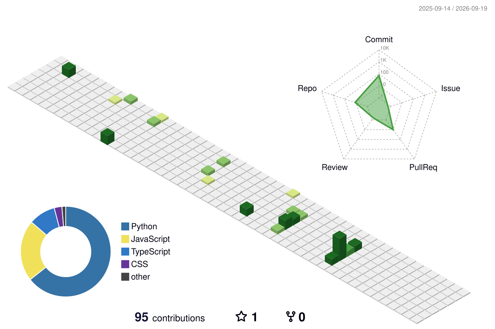

<div align="center">


[](https://manasmankar.com)

[](https://git.io/typing-svg)

<br/>

[](https://linkedin.com/in/manas-mankar)
[](https://manasmankar.com)
[](https://www.instagram.com/mankar_manas/)
[](mailto:manasmahendra5@gmail.com)
[](https://github.com/mankarmanas)


</div>

---


## 👋 Hey, I'm Manas!

- 🎓 **MS Computer Science** @ Pace University, NYC — GPA: **3.84 / 4.0**
- 🤖 Specializing in **AI Engineering** — RAG pipelines, LangChain, LLM orchestration
- 🌐 Full-stack developer in love with **MERN** & **FastAPI**
- 🏆 **1st Runner-Up** — Pace University × MemVerge Hackathon 2025
- 🌍 Volunteered @ **Google DevFest NYC 2025** (Pier 57, Google NYC)
- ☁️ Pursuing **AWS Cloud Practitioner & Solutions Architect**
- 🔄 Mechanical Engineer turned Software Engineer — I bring both worlds together
- 📍 Bayonne, NJ | Open to relocation & remote

<br clear="right"/>

---

## 🛠️ Tech Stack

### 💻 Languages


### 🎨 Frontend


### ⚙️ Backend & APIs


### 🤖 AI / ML


### 🗄️ Databases


### 🎨 UI / UX


### 🔧 DevOps, Cloud & Tools


---

## 🚀 Featured Projects

---

<div align="center">
<h3>🏆 Adaptus — Adaptive AI Learning Platform</h3>


</div>

> An intelligent study platform that **dynamically routes each learning session** to the most suitable LLM (OpenAI, Anthropic, or Google AI) based on the learner's profile — delivering truly personalized, adaptive education.

**✨ Key Features:**
- 🧠 **Persistent Learner Memory** — uses **MemMachine** to remember learning style, pace & weak areas across all sessions
- 🔀 **Dynamic LLM Routing** — real-time selection across 3 AI providers via a modular **Python FastAPI** backend
- 💬 **Interactive Lesson Delivery** — real-time feedback loops with lightweight HTML/CSS/JS frontend
- 📡 **RESTful API Architecture** — CORS-configured, provider-swappable modular design for fast iteration

**📊 Impact:**
| Metric | Result |
|--------|--------|
| Lesson relevance across repeat sessions | **↑ ~40%** |
| LLM provider experimentation time | **↓ 3x faster** |
| Providers integrated in 24 hrs | **3 (OpenAI · Anthropic · Google)** |

**🔧 Stack:**


[](https://github.com/mankarmanas)

---

<div align="center">
<h3>💊 PharmaXpert — Full-Stack Pharmacy Management System</h3>


</div>

> A production-grade **MERN pharmacy management platform** automating end-to-end pharmacy operations — from inventory tracking to prescription workflows and financial reporting.

**✨ Key Features:**
- 📦 **Inventory Management** — real-time medication tracking with low-stock alerts, preventing stockouts
- 📋 **Prescription Module** — digital prescription intake, processing, and history logging
- 🔐 **Secure Authentication** — JWT-based role access for pharmacists, admins, and staff
- 💰 **Sales & Reporting Dashboard** — full transaction history, revenue analytics, and financial visibility
- ⚡ **REST API Backend** — Node.js + Express powering all business logic with MongoDB Atlas

**📊 Impact:**
| Metric | Result |
|--------|--------|
| Transactions handled | **5,000+** |
| Manual operational effort | **↓ ~60%** |
| Stockout incidents | **Significantly reduced** |

**🔧 Stack:**


[](https://github.com/mankarmanas)

---

<div align="center">
<h3>📸 Momentify — Personal Memory Archive App</h3>


</div>

> A full-stack **MERN application** for preserving personal memories — log events, tag friends, write descriptions, and attach up to 10 images per memory using scalable cloud storage.

**✨ Key Features:**
- 🖼️ **Multi-Image Upload** — up to 10 images per memory entry, stored via **Cloudinary** (zero binary data in MongoDB)
- 👥 **Friends Tagging** — attach people to each memory for social context and filtering
- 📝 **Rich Memory Entries** — title, date, description, and friend metadata per entry
- 🚀 **8+ RESTful APIs** — full CRUD operations for memories and images via Express + Node.js
- 🗄️ **Clean DB Architecture** — 100% image-URL separation from document store, improving performance

**📊 Impact:**
| Metric | Result |
|--------|--------|
| RESTful APIs built | **8+** |
| Database query performance | **↑ ~35% faster** |
| Image-DB separation | **100%** via Cloudinary |

**🔧 Stack:**


[](https://github.com/mankarmanas)

---

---

## 📊 GitHub Stats

<div align="center">


</div>

<div align="center">

[](https://git.io/streak-stats)

</div>

<div align="center">

[](https://github.com/ryo-ma/github-profile-trophy)

</div>

---

## 🐍 Contribution Snake

<div align="center">

<picture>
  <source media="(prefers-color-scheme: dark)" srcset="https://raw.githubusercontent.com/mankarmanas/mankarmanas/output/github-snake-dark.svg"/>
  <source media="(prefers-color-scheme: light)" srcset="https://raw.githubusercontent.com/mankarmanas/mankarmanas/output/github-snake.svg"/>
  
</picture>

</div>

---

## 🌐 3D Contribution Calendar

<div align="center">



</div>

---

## 📈 Contribution Activity

<div align="center">

[](https://github.com/ashutosh00710/github-readme-activity-graph)

</div>

---

## 🌱 Currently Working On

```python
manas = {
    "learning"  : ["RAG Pipelines", "LangChain Agents", "AWS Solutions Architect"],
    "building"  : ["AI-powered full-stack apps", "LLM orchestration systems"],
    "open_to"   : ["Full-time SWE / AI roles", "Internships", "Open-source collaboration"],
    "fun_fact"  : "Mechanical Engineer → AI Engineer. Physics still helps. 🔩→🤖",
    "location"  : "Bayonne, NJ  |  Open to Remote / Relocation 🗽"
}
```

---

---

## 💬 Dev Quote of the Day

<div align="center">

[](https://github.com/piyushsuthar/github-readme-quotes)

</div>

---

## 🎵 My Spotify Playlist — What I Vibe To

<div align="center">


</div>

### 🎤 Justin Bieber Favs

<div align="center">

| # | Song | Artist | Listen |
|:-:|------|--------|:------:|
| 1 | 🎶 **Beauty and a Beat** | Justin Bieber ft. Nicki Minaj | [](https://open.spotify.com/track/6QFCMUUq1T2Vf5sFUXcuQ7) |
| 2 | 🎶 **Stay** | The Kid LAROI & Justin Bieber | [](https://open.spotify.com/track/5HCyWlXZPP0y6Gqq8TgA20) |
| 3 | 🎶 **EVERYTHING HALLELUJAH** | Justin Bieber | [](https://open.spotify.com/track/5AwNJ5mr7mHyIhlKnQICEJ) |

</div>

### 🎵 Marathi Favs

<div align="center">

| # | Song | Artist | Listen |
|:-:|------|--------|:------:|
| 4 | 🎶 **Kitida Navyane** | Aarya Ambekar & Mandar Aapte | [](https://open.spotify.com/track/3AfiaGRrAIIRs2M8XaLkNp) |
| 5 | 🎶 **Zindagi Zindagi** | Sachin Pilgaonkar & Sumeet Raghvan | [](https://open.spotify.com/track/1atBjC8A1QgcAPXF4k8OOi) |

</div>

---

<div align="center">

## 📬 Let's Connect & Build Something Cool

[](https://linkedin.com/in/manas-mankar)
[](https://manasmankar.com)
[](https://www.instagram.com/mankar_manas/)
[](mailto:manasmahendra5@gmail.com)

<br/>


</div>
